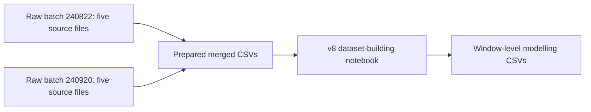
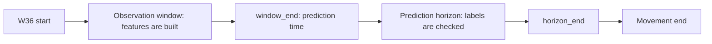
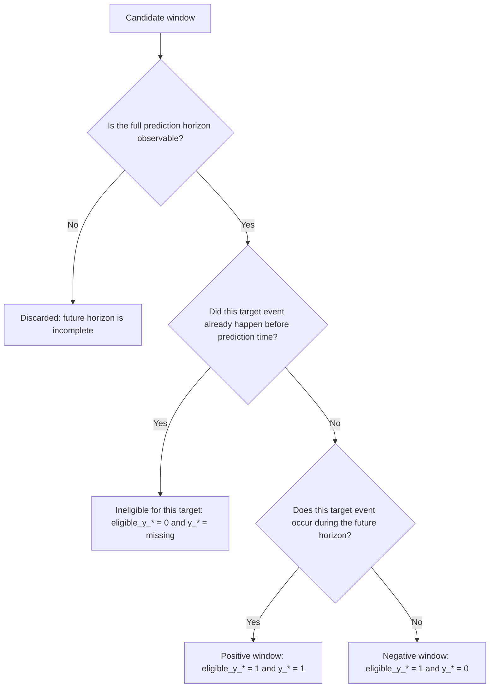

# CGH Inpatient Deterioration Dataset Preparation

This README explains how `Dataset_preparation_modified_v8_final_v1_fixed.ipynb` builds non-sequential modelling datasets for early inpatient deterioration prediction.

It is written for readers who have not seen the project before. It explains the prediction task, input data, cohort rule, cleaning logic, sliding-window labels, feature groups, split design, and output files.

---

## 1. Quick Orientation

### 1.1 One-sentence project objective

This dataset is built to predict whether a CGH W36 inpatient will experience a new clinical deterioration event within the next few hours, using only information available before each prediction time.

### 1.2 What is one row in the final dataset?

One row is **one prediction window for one hospital case**.

It is not one patient, one admission, or one vital-sign measurement. A single case can produce many rows because the notebook creates a new prediction window every 1 hour during the W36 monitoring episode.

### 1.3 The core prediction idea

At each `window_end`, the model looks backward to build features and looks forward to assign labels.

| Time segment | Used for | Example |
|---|---|---|
| Before `window_end` | Predictor features | Demographics, diagnosis groups, prior events, vital-sign summaries |
| After `window_end` and before `horizon_end` | Target labels | Whether O2 increase, MET activation, HD/ICU transfer, IV increase, death, or any deterioration occurs |

The model should never use future information as predictors.

### 1.4 Key time terms

| Term | Meaning |
|---|---|
| `W36 Start DT` | Start of the W36 monitoring episode for one case |
| `Movement End DT` | End of the observable W36 monitoring episode |
| `window_start` | Start of the observation window |
| `window_end` | End of the observation window; this is the prediction time |
| `horizon_end` | End of the future prediction horizon |
| `m_hours` | Observation-window length: 4, 6, 12, or 24 hours |
| `h_hours` | Prediction-horizon length: 4, 6, or 12 hours |

---

## 2. Data Sources

### 2.1 Original raw data structure

The project combines two data batches:

- `240822`
- `240920`

Each batch originally contains five source datasets.

| Source type | Description |
|---|---|
| `Respiree_PatientInfo_ano` | Patient admission, ward-stay, demographic, and episode-level information |
| `eHINTS_data_ano` | Deterioration-related outcome fields, including HD/ICU transfer, O2 increase, IV increase, MET activation, and death-related fields |
| `eHINTS_diag_ano` | Diagnosis information |
| `eHINTS_vitalSigns_ano` | Manually charted vital signs |
| `Respiree_vital_sign` | Respiree sensor vital-sign time series |

### 2.2 Files directly loaded by the v8 notebook

The v8 notebook does **not** directly reload the ten raw files. It starts from prepared merged CSV files stored under:

```text
/content/drive/My Drive/merged_240920_240822_prepared
```

| Prepared file | Role in v8 pipeline |
|---|---|
| `case_master_all_240920_240822.csv` | Main case-level table with patient information, W36 episode times, source-availability flags, and deterioration outcome fields |
| `charted_vitals_all_240920_240822.csv` | Manually charted vital-sign records |
| `diagnosis_summary_all_240920_240822.csv` | Case-level diagnosis summary; v8 uses `secondary_diagnosis_list` |
| `sensor_timeseries_all_240920_240822.csv` | Respiree sensor vital-sign time series |
| `cohort_summary_all_240920_240822.csv` | Cohort-checking summary file loaded for audit/reference |

### 2.3 Data flow overview



---

## 3. Cohort Selection Rule

The modelling cohort keeps only cases that appear in all required project data sources.

In the v8 notebook, a case is included only when all source-availability flags below are equal to 1:

```python
has_ehints_data == 1
has_diagnosis == 1
has_charted_vitals == 1
has_respiree_sensor == 1
```

The retained cases are then filtered to valid W36 monitoring episodes:

```python
W36 Start DT_dt is not missing
Movement End DT_dt is not missing
Movement End DT_dt > W36 Start DT_dt
```

Therefore, each final case has outcome information, diagnosis information, charted vitals, Respiree sensor vitals, and a valid W36 start/end time.

---

## 4. Data Cleaning Steps

### 4.1 Standardize case IDs

All loaded tables receive a cleaned `case_no_deid_clean` column.

The cleaning removes extra spaces and fixes IDs that may be read as decimal-looking values.

```text
123.0 -> 123
```

This reduces failed joins caused by formatting differences across files.

### 4.2 Convert datetime columns

Important case-level, charted-vital, and sensor-vital time columns are converted into datetime format. Invalid datetime values are coerced to missing.

| Column | Purpose |
|---|---|
| `W36 Start DT_dt` | Monitoring episode start |
| `Movement End DT_dt` | Monitoring episode end |
| `O2 increased provision DT_dt` / `o2_increase_event_dt` | O2 increase event time source |
| `Increased IV DT_dt` | IV increase event time |
| `MET activation after W36 Admission_dt` | MET activation event time |
| `Death Date_dt` | Death event time |
| `next hd/icu admission dt_dt` | HD/ICU transfer event time |
| `created_datetime_dt` | Charted-vital measurement time |
| `sensor_datetime_dt` | Sensor-vital measurement time |

### 4.3 Define case-level outcome flags

The notebook first defines deterioration at case level. These flags answer: **did this case ever have this event?**

| Case-level label | Main logic |
|---|---|
| `label_hd_icu` | `HD/ICU == 1` or non-missing next HD/ICU admission time |
| `label_o2_increase` | Uses `o2_increase_confirmed == 1` when available; otherwise falls back to O2 event timestamp |
| `label_iv_increase` | Non-missing IV increase timestamp |
| `label_met` | Non-missing MET activation timestamp |
| `label_death` | Death 1M, Death 3M, or non-missing death date |
| `label_any_deterioration` | Any of the five event labels is positive |

### 4.4 Define usable event timestamps

Window-level labels require event timestamps. A case may be case-level positive but still lack a usable event time.

The notebook creates these event-time columns:

| Event-time column | Event |
|---|---|
| `event_time_hd_icu` | HD/ICU transfer |
| `event_time_o2` | Confirmed O2 increase |
| `event_time_iv` | IV increase |
| `event_time_met` | MET activation |
| `event_time_death` | Death |

For O2 increase, if the case is not confirmed as O2 increase, its O2 timestamp is set to missing for labelling. This avoids false positive O2 windows caused by non-confirmed timestamps.

### 4.5 Keep diagnosis feature handling separate

Secondary-diagnosis processing is important enough to be documented as a separate section. In short, the notebook uses `secondary_diagnosis_list`, excludes primary diagnosis, converts raw diagnosis text into grouped dummy variables, and merges those grouped features back into the case-level cohort.

See **Section 5. Secondary Diagnosis Extraction and Categorization** for the full logic.

### 4.6 Remove internal labelling columns before final saving

Event-time columns and `Movement End DT` are needed for labelling and censoring. They are removed from the final modelling CSVs after labels are created.

---


## 5. Secondary Diagnosis Extraction and Categorization

This section documents how the notebook turns secondary-diagnosis text into usable model features.

The goal is not to predict from hundreds of rare diagnosis phrases. Instead, the notebook extracts clinically meaningful risk markers from secondary diagnoses and stores them as compact case-level dummy variables.

### 5.1 Why secondary diagnosis is used

The notebook uses **secondary diagnosis only**.

Project background suggests that secondary diagnoses were mostly available before W36 ward admission, so they can represent baseline comorbidity and risk burden. Primary diagnosis is intentionally excluded because it may be finalized later, including after W36 admission or after discharge, which could introduce leakage.

In plain words:

```text
Use secondary diagnosis as baseline risk context.
Do not use primary diagnosis as a main predictor in this version.
```

### 5.2 Input column

The diagnosis input comes from:

```text
diagnosis_summary_all_240920_240822.csv
```

The notebook uses these two columns:

| Column | Role |
|---|---|
| `case_no_deid_clean` | Case identifier |
| `secondary_diagnosis_list` | Pipe-separated secondary diagnosis text |

A typical secondary-diagnosis field may contain multiple diagnoses separated by `|`.

```text
Diagnosis A | Diagnosis B | Diagnosis C
```

### 5.3 Extraction steps

The extraction process is:

1. Keep `case_no_deid_clean` and `secondary_diagnosis_list`.
2. Standardize the case ID.
3. Split `secondary_diagnosis_list` by `|`.
4. Explode the list so that each row contains one case and one diagnosis phrase.
5. Strip extra spaces.
6. Remove empty or placeholder values such as empty strings, `nan`, `None`, and `**********`.
7. Remove duplicate diagnosis phrases for the same case.
8. Normalize diagnosis text by lowercasing it and removing punctuation.

The normalized text is used only for keyword matching. The original diagnosis description is still used in the frequency-checking file.

### 5.4 Categorization logic

The notebook uses keyword-based grouping. Each diagnosis phrase is checked against a dictionary of clinically meaningful keyword groups.

For each group:

```text
If any keyword from the group appears in the cleaned diagnosis text,
set the group flag to 1 for that diagnosis row.
```

Then the notebook aggregates to case level:

```text
If a case has at least one diagnosis phrase matching the group,
set the case-level group flag to 1.
```

A case can belong to multiple secondary-diagnosis groups. For example, the same case can be flagged as both `secondary_dx_respiratory = 1` and `secondary_dx_cardiac = 1`.

### 5.5 Diagnosis groups created

The grouped secondary-diagnosis features include these categories:

| Feature group | Main clinical meaning |
|---|---|
| `secondary_dx_infection_sepsis` | Infection, sepsis, bacteraemia, UTI-related terms |
| `secondary_dx_pneumonia` | Pneumonia and bronchopneumonia |
| `secondary_dx_respiratory` | Respiratory failure, COPD, asthma, hypoxia, pulmonary oedema, pleural effusion, and related terms |
| `secondary_dx_cardiac` | Heart failure, ischemic heart disease, myocardial infarction, arrhythmia, coronary disease, and related terms |
| `secondary_dx_thrombosis_embolism` | Pulmonary embolism, thrombosis, DVT |
| `secondary_dx_renal_any` | Any renal, kidney, nephropathy, or dialysis-related term |
| `secondary_dx_acute_kidney_failure` | AKI, acute kidney injury, acute renal failure |
| `secondary_dx_ckd_stage_3_5_or_dialysis` | CKD stage 3–5 or dialysis |
| `secondary_dx_diabetes_complication` | Diabetes with complications or poor control |
| `secondary_dx_hypertension` | Hypertension-related terms |
| `secondary_dx_electrolyte_acid_base_volume` | Electrolyte, acid-base, dehydration, volume depletion, or fluid overload terms |
| `secondary_dx_anemia_bleeding_coagulation` | Anaemia, bleeding, thrombocytopenia, pancytopenia, neutropenia, and coagulation terms |
| `secondary_dx_malignancy` | Cancer, carcinoma, neoplasm, lymphoma, leukaemia, tumour/tumor |
| `secondary_dx_metastatic_cancer` | Metastatic or secondary malignant disease |
| `secondary_dx_neuro_delirium_stroke` | Delirium, dementia, stroke, seizure, Parkinson-related, neurological terms |
| `secondary_dx_liver_cirrhosis_failure` | Cirrhosis, hepatic failure, liver failure, portal hypertension |
| `secondary_dx_gi_acute` | GI haemorrhage, obstruction, perforation, peritonitis, ileus, melena, haematemesis |
| `secondary_dx_frailty_pressure_ulcer_dysphagia_fall` | Frailty, pressure ulcer, dysphagia, fall, malnutrition, cachexia, walking difficulty |
| `secondary_dx_hypotension_shock` | Hypotension and shock-related terms |

The exact keyword list is defined in notebook Cell 8A.

### 5.6 Case-level diagnosis features

After grouping, the notebook creates one row per case with these features:

| Feature | Meaning |
|---|---|
| `secondary_diagnosis_count` | Number of unique cleaned secondary-diagnosis phrases for the case |
| `secondary_dx_*` | One dummy variable per diagnosis group |
| `secondary_dx_severe_group_count` | Number of secondary-diagnosis groups flagged for the case |

If a full-cohort case has no usable secondary diagnosis after cleaning, the notebook still keeps the case and fills diagnosis features with 0. This avoids silently dropping cases during diagnosis merging.

### 5.7 Diagnosis checking outputs

The notebook saves three files to help audit the diagnosis processing:

| File | Purpose |
|---|---|
| `secondary_diagnosis_grouped_features.csv` | Case-level grouped diagnosis dummy features |
| `secondary_diagnosis_group_summary_with_outcome_rates.csv` | Diagnosis-group prevalence and outcome rates |
| `secondary_diagnosis_frequency.csv` | Frequency of cleaned secondary-diagnosis descriptions |

These files are useful for checking whether the groups are too rare, too broad, or unexpectedly associated with outcomes.

### 5.8 Rerun safety

Before merging grouped diagnosis features back into `full_cohort`, the notebook removes old secondary-diagnosis columns if they already exist.

This prevents repeated Colab runs from creating duplicated columns such as:

```text
secondary_diagnosis_count_x
secondary_diagnosis_count_y
```

This step also avoids downstream errors where the clean column name no longer exists.


## 6. Vital Sign Processing

The notebook creates one unified long-format vital-sign table.

```text
case_no_deid_clean | vital_time | vital_name | vital_value
```

### 6.1 Charted vital signs

Charted vital signs are filtered to full-cohort cases, assigned `vital_time`, and converted into long format if needed.

Expected charted vital types include:

```text
HR, RR, SpO2, temperature, SBP, DBP
```

The notebook also standardizes source-specific or duplicated names.

```text
charted_HR -> HR
charted_charted_HR -> HR
```

### 6.2 Sensor vital signs

Sensor records are retained only when:

```python
is_linked_to_case == 1
within_patientinfo_episode == 1
sensor_datetime_dt is not missing
```

Sensor columns are converted from wide format to long format.

Sensor vital types include:

```text
RR, HR, SpO2, skin_temperature, body_temperature
```

### 6.3 Unified vital-sign names

Clinically comparable charted and sensor variables are merged into one stream.

| Source variables | Unified variable |
|---|---|
| Charted HR + sensor HR | `HR` |
| Charted RR + sensor RR | `RR` |
| Charted SpO2 + sensor SpO2 | `SpO2` |
| Charted temperature + sensor body temperature | `temperature` |
| Sensor skin temperature | `skin_temperature` |
| Charted SBP | `SBP` |
| Charted DBP | `DBP` |

`skin_temperature` is kept separate because it is not the same clinical variable as body temperature.

### 6.4 Full-window vital features

For each vital sign inside each observation window, the notebook creates these summaries.

| Feature suffix | Meaning |
|---|---|
| `_mean` | Average value in the window |
| `_min` | Minimum value in the window |
| `_max` | Maximum value in the window |
| `_std` | Standard deviation in the window; set to 0 if only one value exists |
| `_count` | Number of measurements in the window |
| `_last` | Last observed value before `window_end` |
| `_first` | First observed value in the window |
| `_delta` | Last value minus first value |
| `_slope` | Change per hour from first to last value; missing if fewer than two values or zero time gap |
| `_time_since_last` | Hours between last measurement and `window_end` |
| `_missing_flag` | 1 if this vital sign is missing in the window; otherwise 0 |

Example columns:

```text
HR_mean
HR_min
HR_max
HR_std
HR_count
HR_last
HR_first
HR_delta
HR_slope
HR_time_since_last
HR_missing_flag
```

### 6.5 Baseline/recent split inside each observation window

Each observation window is split into two equal parts.

```text
baseline = earlier half of the observation window
recent   = later half of the observation window
```

For example, if `m_hours = 12`:

```text
baseline = first 6 hours of the observation window
recent   = last 6 hours before window_end
```


The same vital-sign summaries are calculated for both halves using prefixes:

```text
baseline_
recent_
```

Example columns:

```text
baseline_HR_mean
recent_HR_mean
baseline_RR_max
recent_RR_max
```

### 6.6 Why baseline + recent features are used

Full-window features summarize the whole observation window, but they can hide short-term deterioration.

For example, a 12-hour average HR may look acceptable even if HR rose sharply in the last few hours. The baseline/recent split helps the model compare the patient's recent physiology against their own earlier status in the same observation window.

The intention is:

| Feature type | Question answered |
|---|---|
| Full-window feature | What was the overall physiological status during the window? |
| Baseline feature | What was the earlier status in this window? |
| Recent feature | What was the later status closer to prediction time? |
| Recent-minus-baseline feature | Did the patient become better, worse, or more frequently measured recently? |

This design is especially useful for deterioration prediction because worsening trends may matter more than absolute values alone.

Important naming note: `baseline_` in columns such as `baseline_HR_mean` means the earlier half of the observation window. It should not be confused with the feature-set name `baseline_patient_vital`, where “baseline” means the basic model feature set without optional diagnosis, prior-event, or short-recent additions.

### 6.7 Recent-minus-baseline contrast features

The notebook creates recent-minus-baseline contrast features for these metrics:

```text
mean, min, max, count
```

Example:

```text
recent_minus_baseline_HR_mean
```

The interpretation is direct:

```text
recent_minus_baseline_HR_mean = recent_HR_mean - baseline_HR_mean
```

A positive value means the recent half had a higher mean HR than the earlier half. A negative value means the recent half had a lower mean HR. For count features, a positive value means the patient was measured more often recently, which may itself reflect clinical concern or monitoring intensity.

### 6.8 Fixed short-recent features: last 60 minutes and last 30 minutes

The notebook also creates fixed short-recent summaries immediately before `window_end`.

| Prefix | Time range |
|---|---|
| `last60min_` | Last 60 minutes before `window_end` |
| `last30min_` | Last 30 minutes before `window_end` |

For each vital sign, these short-recent summaries include:

```text
mean, min, max, std, count, last
```

Example columns:

```text
last60min_HR_last
last60min_SpO2_min
last30min_RR_max
last30min_temperature_mean
```

### 6.9 Why both recent 60-minute and recent 30-minute features are used

The 60-minute and 30-minute recent windows are created for comparison, not because one is assumed to be always better.

Their intentions are different:

| Short-recent window | Main intention | Possible weakness |
|---|---|---|
| Last 60 minutes | Capture near-term deterioration with slightly more stable measurement coverage | May smooth over very acute changes |
| Last 30 minutes | Capture very acute changes immediately before prediction time | More likely to be sparse or noisy, especially for charted vitals |

This gives the modelling stage a fair comparison:

```text
Does the model benefit more from a broader recent signal, or from the most immediate signal?
```

For sensor variables, 30-minute features may capture acute physiological changes. For manually charted variables, 60-minute features may be more reliable because charted measurements are often less frequent.

### 6.10 Vital availability features

The notebook adds simple missingness and availability features.

| Feature | Meaning |
|---|---|
| `available_vital_type_count` | Number of vital-sign types available in the window |
| `missing_vital_type_count` | Number of vital-sign types missing in the window |
| `core_available_vital_count` | Number of available core vitals among HR, RR, SpO2, temperature, SBP, DBP |
| `core_missing_vital_count` | Number of missing core vitals |
| `all_core_vitals_available_flag` | 1 if all core vitals are available |

---

## 7. Sliding Window Design and Label Construction

Labels are explained together with sliding windows because a label only has meaning relative to a specific `window_end` and `horizon_end`.

### 7.1 Window settings

| Setting | Values |
|---|---|
| Observation windows `m_hours` | 4, 6, 12, 24 |
| Prediction horizons `h_hours` | 4, 6, 12 |
| Sliding step | 1 hour |

For one case:

```text
window_start = W36 Start DT + k hours
window_end   = window_start + m_hours
horizon_end  = window_end + h_hours
```

A candidate window is first created only if:

```text
window_end <= Movement End DT
```

It is saved into a final labelled dataset only if the full future horizon is observable:

```text
horizon_end <= Movement End DT
```

### 7.2 Timeline visualization



Plain-language rule:

```text
Features come from the observation window.
Labels come from the future prediction horizon.
The future horizon must be fully observable; otherwise the window is discarded.
```

### 7.3 Positive, negative, ineligible, and discarded windows

For an event-specific target such as `y_o2`, the notebook applies the following rule.



The event is counted as positive only if:

```python
event_time >= window_end
event_time < horizon_end
```

The lower bound is inclusive and the upper bound is exclusive.

### 7.4 Four examples of window labels

| Scenario | Result for that target | Why |
|---|---|---|
| O2 increase occurs between `window_end` and `horizon_end` | `eligible_y_o2 = 1`, `y_o2 = 1` | The target event occurs in the prediction horizon |
| No O2 increase occurs before `horizon_end` | `eligible_y_o2 = 1`, `y_o2 = 0` | The target event has not occurred yet and does not occur in the horizon |
| O2 increase already happened before `window_end` | `eligible_y_o2 = 0`, `y_o2 = missing` | The model should not predict an event that has already happened |
| `horizon_end` is after `Movement End DT` | Window is discarded | The full future horizon is not observable |

A window can be ineligible for one target but still useful for another target. For example, a row can be ineligible for `y_o2` but eligible for `y_met`.

### 7.5 Target columns

The final window datasets contain six target columns.

| Target | Meaning |
|---|---|
| `y_any` | Any new not-yet-occurred deterioration event inside the prediction horizon |
| `y_hd_icu` | New HD/ICU transfer inside the prediction horizon |
| `y_o2` | New confirmed O2 increase inside the prediction horizon |
| `y_iv` | New IV increase inside the prediction horizon |
| `y_met` | New MET activation inside the prediction horizon |
| `y_death` | New death event inside the prediction horizon |

Each target has a matching eligibility column.

```text
eligible_y_any
eligible_y_hd_icu
eligible_y_o2
eligible_y_iv
eligible_y_met
eligible_y_death
```

During modelling, eligibility columns should be used for filtering valid rows for the selected target. They should not be used as model predictors.

### 7.6 Case-level labels versus window-level labels

| Concept | Meaning | Example |
|---|---|---|
| Case-level positive | The case ever had an event | Patient eventually had MET activation |
| Timed positive case | The case had an event with a usable timestamp | MET activation time is known |
| Positive window | The event occurs inside this row's prediction horizon | MET occurs between `window_end` and `horizon_end` |
| Eligible window | The selected event had not already happened before `window_end` | MET had not happened yet |

This distinction matters because one positive case can generate many negative windows before the positive event window.

### 7.7 Cascade modelling design

The v8 dataset is cascade-capable.

Earlier deterioration events are kept as valid history if they happened before `window_end`. For example:

```text
prior_o2 = 1
time_since_prior_o2_hours = hours since previous O2 increase
```

These features are leakage-safe because they are known at prediction time.

Created prior-event features include:

```text
prior_hd_icu
prior_o2
prior_iv
prior_met
prior_death
time_since_prior_hd_icu_hours
time_since_prior_o2_hours
time_since_prior_iv_hours
time_since_prior_met_hours
time_since_prior_death_hours
prior_event_count
any_prior_deterioration_flag
time_since_first_prior_event_hours
time_since_most_recent_prior_event_hours
```

---

## 8. Feature Groups

A direct way to understand the final modelling features is to group them by how they are created and whether they should be used as predictors.

| Feature group | Examples | Predictor? | Interpretation |
|---|---|---:|---|
| Metadata | `case_no_deid_clean`, `data_split`, `m_hours`, `h_hours`, `window_start`, `window_end`, `horizon_end` | No | Identifies case, split, and window |
| Targets and eligibility | `y_any`, `y_o2`, `eligible_y_o2` | No | Labels and target-specific filtering indicators |
| Demographics / patient context | `Age`, `Gender`, `Race`, `Admit Type Description`, `data_batch`, `hours_since_w36_start` | Yes | Case-level and prediction-time context |
| Full-window vital features | `HR_mean`, `RR_max`, `SpO2_slope`, `temperature_time_since_last` | Yes | Overall physiological status across the whole observation window |
| Baseline/recent vital features | `baseline_HR_mean`, `recent_HR_mean`, `baseline_RR_max`, `recent_RR_max` | Yes | Earlier-half versus later-half status inside the same observation window |
| Baseline/recent contrast features | `recent_minus_baseline_HR_mean`, `recent_minus_baseline_RR_count` | Yes | Recent change compared with the patient's own earlier status |
| Short-recent 60-minute features | `last60min_HR_last`, `last60min_SpO2_min` | Optional | Near-term physiology before prediction time |
| Short-recent 30-minute features | `last30min_RR_max`, `last30min_temperature_mean` | Optional | Very immediate physiology before prediction time |
| Vital availability features | `available_vital_type_count`, `all_core_vitals_available_flag` | Yes | Missingness and measurement availability signals |
| Secondary diagnosis features | `secondary_dx_respiratory`, `secondary_dx_cardiac`, `secondary_diagnosis_count` | Optional | Grouped secondary-diagnosis risk markers |
| Prior-event cascade features | `prior_o2`, `time_since_prior_o2_hours`, `prior_event_count` | Yes for cascade modelling | Deterioration history already known before prediction time |

The word “optional” means the notebook creates these features, but the modelling helper allows them to be added or excluded for comparison.

### 8.1 Simple rule for grouping features

A practical rule is:

```text
Core model features = demographics + full-window vitals + baseline/recent vitals + contrast features + vital availability
Optional comparison features = secondary diagnosis + last60min + last30min + prior-event history
Never predictors = metadata + targets + eligibility indicators + internal event timestamps
```

This rule keeps feature selection understandable while still allowing controlled model comparisons.

### 8.2 Feature-set helper functions

The notebook defines helper functions for leakage-safe feature selection. These functions are intended to be used after loading one generated train/validation/test CSV.

Main cascade feature sets:

| Feature set name | Included groups |
|---|---|
| `baseline_patient_vital` | Demographics + full-window vitals + baseline/recent vitals + contrast features + vital availability |
| `cascade_patient_vital_history` | `baseline_patient_vital` + prior-event history |
| `cascade_plus_secondary_dx` | Cascade patient/vital/history features + secondary diagnosis groups |
| `cascade_plus_last60min` | Cascade patient/vital/history features + last-60-minute vital features |
| `cascade_plus_last30min` | Cascade patient/vital/history features + last-30-minute vital features |
| `cascade_final60_dx_last60` | Cascade patient/vital/history features + secondary diagnosis + last-60-minute features |
| `cascade_final30_dx_last30` | Cascade patient/vital/history features + secondary diagnosis + last-30-minute features |
| `cascade_full_optional_dx_last60_last30` | Cascade patient/vital/history features + secondary diagnosis + both short-recent feature sets |

Naming note: `baseline_patient_vital` is the basic comparison feature set. It still contains baseline/recent split features. It is called “baseline” because it excludes optional add-ons such as secondary diagnosis, short-recent features, and prior-event history.

Example use:

```python
X, y, feature_cols = prepare_model_data(
    df=train_df,
    target_col="y_o2",
    feature_set_name="cascade_final60_dx_last60"
)
```

This helper automatically removes rows where `eligible_y_o2 != 1` and removes rows with missing `y_o2`.

### 8.3 First-deterioration subset

The same v8 dataset can also be used for first-deterioration prediction.

First-deterioration windows are rows where no deterioration event happened before `window_end`:

```python
prior_event_count == 0
any_prior_deterioration_flag == 0
```

This subset answers a narrower question:

> Before any deterioration has happened, can the model predict whether deterioration will occur in the next `h` hours?

The notebook provides separate helper functions for this setting:

```python
filter_first_deterioration_windows(df)
prepare_first_deterioration_model_data(df, target_col, feature_set_name)
```

## 9. Train / Validation / Test Split

The split is performed at case level, not window level.

This prevents windows from the same case appearing in both training and testing data.

The split ratio is:

```text
70% train
15% validation
15% test
```

The split is stratified by:

```python
label_any_deterioration
```

The notebook uses:

```python
random_state = 42
```

After case-level split assignment, every generated window inherits the split of its parent case.

---

## 10. Output Files

The v8 output folder is:

```text
/content/drive/My Drive/merged_240920_240822_prepared/nonsequential_window_dataset_v8_cascade
```

### 10.1 Final modelling datasets

For each observation window `m` and prediction horizon `h`, the notebook saves train, validation, and test CSV files.

Folder pattern:

```text
m{m}_h{h}/
```

File pattern:

```text
{split}_m{m}_h{h}.csv
```

Examples:

```text
m6_h12/train_m6_h12.csv
m6_h12/validation_m6_h12.csv
m6_h12/test_m6_h12.csv
```

Because `m = [4, 6, 12, 24]` and `h = [4, 6, 12]`, the notebook can generate 12 dataset combinations. Each combination has three split files.

### 10.2 Internal feature bases

Reusable feature bases are saved under:

```text
feature_bases_internal/
```

File pattern:

```text
{split}_feature_base_m{m}.csv
```

These files are created before prediction-horizon labels are added. They may include internal event-time columns and `Movement End DT`, so they should not be used directly for final model training.

### 10.3 Summary and checking files

| File | Purpose |
|---|---|
| `case_split_summary.csv` | Case-level split size, case-level positive counts, and timed-positive case counts |
| `dataset_generation_summary.csv` | Row counts, column counts, case counts, eligible-window counts, positive-window counts, and positive-case counts for generated datasets |
| `missingness_summary.csv` | Missingness rate of generated missing-flag features |
| `horizon_censoring_summary.csv` | Number and rate of windows removed because the full prediction horizon was not observable |
| `secondary_diagnosis_grouped_features.csv` | Case-level grouped secondary diagnosis dummy features |
| `secondary_diagnosis_group_summary_with_outcome_rates.csv` | Diagnosis-group summary with case counts and outcome rates |
| `secondary_diagnosis_frequency.csv` | Frequency of cleaned secondary diagnosis terms |

---

## 11. How to Use the Final CSVs for Modelling

A typical modelling workflow is:

1. Choose one `m_hours` and one `h_hours` dataset folder, such as `m6_h12`.
2. Load the corresponding train, validation, and test CSV files.
3. Choose one target, such as `y_any` or `y_o2`.
4. Filter to eligible rows for that target, or use `prepare_model_data(...)` from the notebook.
5. Select one feature set, such as `baseline_patient_vital` or `cascade_final60_dx_last60`.
6. Train and evaluate the model.

Important modelling reminders:

- Do not use target columns as predictors.
- Do not use eligibility columns as predictors.
- Do not use metadata columns as ordinary clinical predictors.
- Use the matching `eligible_y_*` column when training event-specific models.
- For first-deterioration modelling, filter to rows with no prior deterioration first.

---

## 12. Known Limitations and Future Improvements

1. **Composite and event-specific outcomes may behave differently.**

   `y_any` is useful for general deterioration prediction, but HD/ICU transfer, O2 increase, IV increase, MET activation, and death may follow different clinical pathways. Event-specific models should still be compared.

2. **Charted and sensor vital signs are merged into one clinical stream.**

   This improves interpretability, but charted and sensor measurements may differ in frequency, noise level, and clinical meaning. Later versions may compare merged versus source-separated vital streams.

3. **Secondary diagnosis grouping is keyword-based.**

   Grouped secondary diagnosis features are more interpretable than sparse raw diagnosis dummies, but keyword grouping may miss some clinically relevant diagnoses or include imperfect matches.

---

## 13. Reproducibility Notes

Main dataset-building notebook:

```text
Dataset_preparation_modified_v8_final_v1_fixed.ipynb
```

Key implementation choices:

- Window step is 1 hour.
- Observation windows are 4, 6, 12, and 24 hours.
- Prediction horizons are 4, 6, and 12 hours.
- Splitting is done by case, not by window.
- Primary diagnosis is excluded from model features.
- Secondary diagnosis is grouped into clinically meaningful dummy variables.
- Internal event timestamps are used only for label construction and are removed before final CSV saving.
- Eligibility columns are used for target-specific filtering, not as model predictors.
- Feature bases are saved for efficiency, but final modelling should use the labelled split CSVs.

---

## 14. Reader Confusion Checklist Used to Improve This README

This section records the review questions used to make the README clearer for a new reader.

| Confusion question | Clarification added |
|---|---|
| What exactly is one row in the final dataset? | Added Quick Orientation section explaining one row = one case-window |
| Are the notebook inputs raw files or prepared merged files? | Separated original raw data structure from files directly loaded by v8 |
| What is the difference between case-level positive and window-level positive? | Added Section 7.6 |
| Why are some target values missing? | Explained target eligibility and already-happened events |
| When is a window discarded? | Clarified full-horizon observability rule and added Mermaid-safe flowchart |
| Why does the README show `eligible_y_*` instead of a specific column each time? | Explained that the same rule applies to each selected target |
| Are prior events leakage? | Explained cascade design and why prior events before `window_end` are valid |
| Which columns should not be used as predictors? | Added predictor-use column in feature group table and modelling reminders |
| What should be used for first-deterioration modelling? | Added first-deterioration subset rules and helper functions |
| What files are safe for modelling? | Distinguished final labelled CSVs from internal feature bases |
| How are secondary diagnoses extracted and categorized? | Added Section 5 with extraction, normalization, grouping, aggregation, and audit outputs |
| Why use baseline and recent vital features together? | Added Sections 6.5 to 6.7 explaining within-window comparison and contrast features |
| Why create both last-60-minute and last-30-minute features? | Added Section 6.9 explaining the stability versus immediacy trade-off |
