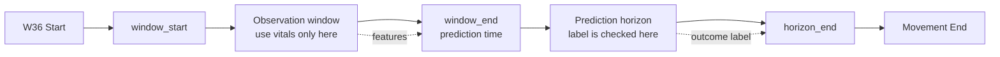

# CGH Inpatient Deterioration Dataset Preparation

## 1. Project Objective

This dataset preparation pipeline builds leakage-controlled, window-level modelling datasets for predicting inpatient deterioration events in CGH W36 patients using patient information, diagnosis groups, charted vital signs, and Respiree sensor vital signs.

---

## 2. Raw Data Sources

The project combines two data batches:

- `240822`
- `240920`

Each batch originally contains five source datasets:

| Source type | Description |
|---|---|
| `Respiree_PatientInfo_ano` | Patient admission, ward-stay, demographic, and episode-level information |
| `eHINTS_data_ano` | Deterioration-related outcome fields, including HD/ICU transfer, O2 increase, IV increase, MET activation, and death-related fields |
| `eHINTS_diag_ano` | Diagnosis information |
| `eHINTS_vitalSigns_ano` | Manually charted vital signs |
| `Respiree_vital_sign` | Respiree sensor vital-sign time series |

In the v8 notebook, these raw files have already been merged into prepared CSV files under:

```text
/content/drive/My Drive/merged_240920_240822_prepared
```

The notebook directly loads the following prepared files:

| Prepared file | Role in v8 pipeline |
|---|---|
| `case_master_all_240920_240822.csv` | Main case-level table containing patient information, episode times, source-availability flags, and deterioration outcome fields |
| `charted_vitals_all_240920_240822.csv` | Charted vital-sign records |
| `diagnosis_summary_all_240920_240822.csv` | Case-level diagnosis summary; v8 uses secondary diagnoses only |
| `sensor_timeseries_all_240920_240822.csv` | Respiree sensor vital-sign records |
| `cohort_summary_all_240920_240822.csv` | Cohort-checking summary file |

---

## 3. Cohort Selection Rule

The modelling cohort keeps only cases that appear in all required project data sources.

In the v8 notebook, a case is included only when all of the following flags are equal to 1:

```python
has_ehints_data == 1
has_diagnosis == 1
has_charted_vitals == 1
has_respiree_sensor == 1
```

Cases are then further filtered to keep only valid monitoring episodes:

```python
W36 Start DT_dt is not missing
Movement End DT_dt is not missing
Movement End DT_dt > W36 Start DT_dt
```

This means each retained case has outcome information, diagnosis information, charted vital signs, Respiree sensor data, and a valid W36 monitoring period.

---

## 4. Data Cleaning Steps

The main cleaning steps are:

1. **Standardize case IDs**

   All source tables are assigned a clean `case_no_deid_clean` column. This removes extra spaces and fixes case IDs that may be read as values like `"123.0"` instead of `"123"`.

2. **Convert time columns**

   Important case-level, charted-vital, and sensor-vital time columns are converted into datetime format. Invalid datetime values are coerced to missing.

3. **Define case-level outcome flags**

   Five deterioration labels are created at case level:

   - HD/ICU transfer
   - O2 increase
   - IV increase
   - MET activation
   - Death

   A composite label, `label_any_deterioration`, is also created.

4. **Define usable event timestamps**

   Window-level labels require event timestamps. A case can be case-level positive but still have no usable event time for sliding-window labelling.

5. **Clean O2 increase logic**

   If `o2_increase_confirmed` exists, the notebook uses this confirmation flag to define O2 increase. This avoids treating non-confirmed O2 timestamps as true O2 increase events.

6. **Use secondary diagnosis only**

   Primary diagnosis is not used as a model feature because it may contain information assigned after W36 admission or discharge. Secondary diagnoses are grouped into clinically meaningful risk groups.

7. **Remove internal time columns before final saving**

   Event-time columns and `Movement End DT` are used internally for labelling and censoring, but they are removed before the final modelling CSVs are saved.

---

## 5. Vital Sign Processing

The notebook combines charted and sensor vital signs into one unified long-format vital-sign table.

### 5.1 Charted vital signs

Charted vital signs are filtered to full-cohort cases and converted into a standard structure:

```text
case_no_deid_clean | vital_time | vital_name | vital_value
```

The notebook can handle charted vitals in either long format or wide format.

Expected charted vital types include:

- `HR`
- `RR`
- `SpO2`
- `temperature`
- `SBP`
- `DBP`

### 5.2 Sensor vital signs

Sensor records are kept only when:

```python
is_linked_to_case == 1
within_patientinfo_episode == 1
sensor_datetime_dt is not missing
```

Sensor vital columns are converted from wide format to long format:

- `RR`
- `HR`
- `SpO2`
- `skin_temperature`
- `body_temperature`

### 5.3 Unified vital-sign names

Clinically comparable charted and sensor variables are merged into one stream:

| Source variables | Unified variable |
|---|---|
| Charted HR + sensor HR | `HR` |
| Charted RR + sensor RR | `RR` |
| Charted SpO2 + sensor SpO2 | `SpO2` |
| Charted temperature + sensor body temperature | `temperature` |
| Sensor skin temperature | `skin_temperature` |

`skin_temperature` is intentionally kept separate because it is not the same clinical variable as body temperature.

### 5.4 Full-window vital-sign features

For each vital sign inside each observation window, the notebook creates:

| Feature suffix | Meaning |
|---|---|
| `_mean` | Average value in the window |
| `_min` | Minimum value in the window |
| `_max` | Maximum value in the window |
| `_std` | Standard deviation in the window; set to 0 if only one value exists |
| `_count` | Number of measurements in the window |
| `_last` | Last observed value before `window_end` |
| `_first` | First observed value in the window |
| `_delta` | Last value minus first value |
| `_slope` | Change per hour from first to last value |
| `_time_since_last` | Hours between the last measurement and `window_end` |
| `_missing_flag` | 1 if the vital sign is missing in the window, otherwise 0 |

### 5.5 Baseline, recent, and contrast features

Each observation window is split into two halves:

```text
baseline = earlier half of the observation window
recent   = later half of the observation window
```

The same vital-sign summaries are calculated for both halves using prefixes:

- `baseline_`
- `recent_`

The notebook then creates recent-minus-baseline contrast features for:

- `mean`
- `min`
- `max`
- `count`

Example:

```text
recent_minus_baseline_HR_mean
```

### 5.6 Fixed short-recent features

The notebook also creates short recent features immediately before `window_end`:

- last 60 minutes: `last60min_`
- last 30 minutes: `last30min_`

For each vital sign, these short-recent summaries include:

- `mean`
- `min`
- `max`
- `std`
- `count`
- `last`

### 5.7 Vital availability features

The notebook adds simple missingness/availability features:

| Feature | Meaning |
|---|---|
| `available_vital_type_count` | Number of vital-sign types available in the window |
| `missing_vital_type_count` | Number of vital-sign types missing in the window |
| `core_available_vital_count` | Number of available core vitals among HR, RR, SpO2, temperature, SBP, DBP |
| `core_missing_vital_count` | Number of missing core vitals |
| `all_core_vitals_available_flag` | 1 if all core vitals are available |

---

## 6. Sliding Window Design and Label Construction

The notebook builds non-sequential window-level datasets.

### 6.1 Window settings

Observation windows:

```python
m_hours = [4, 6, 12, 24]
```

Prediction horizons:

```python
h_hours = [4, 6, 12]
```

Sliding step:

```python
1 hour
```

For each case, windows are generated from `W36 Start DT_dt` until `Movement End DT_dt`.

A window has:

```text
window_start
window_end = window_start + m_hours
horizon_end = window_end + h_hours
```

### 6.2 Window timeline



### 6.3 Positive, negative, and discarded windows

For an event-specific target such as `y_o2`, the label is defined using the event time and the prediction horizon.

```mermaid
flowchart TD
    A[Candidate window] --> B{Is horizon_end <= Movement End DT?}
    B -- No --> X[Discard window<br/>full horizon is not observable]
    B -- Yes --> C{Did the same event already happen before window_end?}
    C -- Yes --> Y[Ineligible for this target<br/>eligible_y_event = 0<br/>y_event = NaN]
    C -- No --> D{Does event happen in<br/>[window_end, horizon_end)?}
    D -- Yes --> P[Positive window<br/>eligible_y_event = 1<br/>y_event = 1]
    D -- No --> N[Negative window<br/>eligible_y_event = 1<br/>y_event = 0]
```

The event is considered positive only if:

```python
event_time >= window_end
event_time < horizon_end
```

The full prediction horizon must be observable:

```python
horizon_end <= Movement End DT
```

Late-stay windows that fail this rule are removed.

### 6.4 Cascade label design

The v8 dataset supports cascade modelling. This means windows after one deterioration event are not automatically removed, because a previous event may be valid clinical history for predicting a later event.

For example, if O2 increase happened before `window_end`, then:

```text
prior_o2 = 1
time_since_prior_o2_hours = hours since O2 increase
```

This is valid because it is known at prediction time.

However, the same event is not predicted again after it has already happened. For example, if O2 increase happened before `window_end`:

```text
eligible_y_o2 = 0
y_o2 = NaN
```

### 6.5 Target columns

The final window datasets contain six target columns:

| Target | Meaning |
|---|---|
| `y_any` | Any new not-yet-occurred deterioration event inside the prediction horizon |
| `y_hd_icu` | New HD/ICU transfer inside the prediction horizon |
| `y_o2` | New O2 increase inside the prediction horizon |
| `y_iv` | New IV increase inside the prediction horizon |
| `y_met` | New MET activation inside the prediction horizon |
| `y_death` | New death event inside the prediction horizon |

Each target has a matching eligibility column:

```text
eligible_y_any
eligible_y_hd_icu
eligible_y_o2
eligible_y_iv
eligible_y_met
eligible_y_death
```

These eligibility columns are used for filtering during model training, not as prediction features.

---

## 7. Feature Groups

A direct way to understand the final modelling features is to group them by how they are created.

| Feature group | Examples | Interpretation |
|---|---|---|
| Metadata | `case_no_deid_clean`, `data_split`, `m_hours`, `h_hours`, `window_start`, `window_end`, `horizon_end` | Identifies the case and window; not used as ordinary clinical predictors |
| Targets and eligibility | `y_any`, `y_o2`, `eligible_y_o2` | Window-level labels and target eligibility indicators |
| Demographics / patient baseline | `Age`, `Gender`, `Race`, `Admit Type Description`, `data_batch`, `hours_since_w36_start` | Case-level and time-since-W36 information known at prediction time |
| Full-window vital features | `HR_mean`, `RR_max`, `SpO2_slope`, `temperature_time_since_last` | Vital-sign summaries over the full observation window |
| Baseline/recent vital features | `baseline_HR_mean`, `recent_HR_mean` | Earlier-half and later-half window summaries |
| Contrast features | `recent_minus_baseline_HR_mean` | Difference between recent and baseline status |
| Short-recent vital features | `last60min_HR_last`, `last30min_RR_max` | Last 60-minute and last 30-minute summaries before prediction time |
| Vital availability features | `available_vital_type_count`, `all_core_vitals_available_flag` | Missingness and measurement availability signals |
| Secondary diagnosis features | `secondary_dx_respiratory`, `secondary_dx_cardiac`, `secondary_diagnosis_count` | Grouped secondary-diagnosis risk markers |
| Prior-event cascade features | `prior_o2`, `time_since_prior_o2_hours`, `prior_event_count` | Deterioration history already known before prediction time |

The notebook also defines leakage-safe feature-set helper functions. The main comparison groups are:

| Feature set name | Included feature groups |
|---|---|
| `baseline_patient_vital` | Patient baseline + vital-sign features |
| `cascade_patient_vital_history` | Patient baseline + vital-sign features + prior-event history |
| `cascade_plus_secondary_dx` | Cascade features + secondary diagnosis groups |
| `cascade_plus_last60min` | Cascade features + last-60-minute vital features |
| `cascade_plus_last30min` | Cascade features + last-30-minute vital features |
| `cascade_final60_dx_last60` | Cascade features + secondary diagnosis + last-60-minute features |
| `cascade_final30_dx_last30` | Cascade features + secondary diagnosis + last-30-minute features |
| `cascade_full_optional_dx_last60_last30` | Cascade features + secondary diagnosis + both short-recent feature sets |

For first-deterioration modelling, the notebook keeps only windows where:

```python
prior_event_count == 0
any_prior_deterioration_flag == 0
```

This subset answers a different question: before any deterioration has happened, can the model predict whether deterioration will happen in the next `h` hours?

---

## 8. Train / Validation / Test Split

The split is performed at case level, not window level.

This prevents windows from the same patient/case appearing in both training and testing data.

The split ratio is:

```text
70% train
15% validation
15% test
```

The split is stratified by:

```python
label_any_deterioration
```

The notebook uses:

```python
random_state = 42
```

After the case-level split is assigned, each generated window inherits the split of its parent case.

---

## 9. Output Files

The v8 output folder is:

```text
/content/drive/My Drive/merged_240920_240822_prepared/nonsequential_window_dataset_v8_cascade
```

### 9.1 Final modelling datasets

For each observation window `m` and prediction horizon `h`, the notebook saves train, validation, and test CSV files.

Folder pattern:

```text
m{m}_h{h}/
```

File pattern:

```text
train_m{m}_h{h}.csv
validation_m{m}_h{h}.csv
test_m{m}_h{h}.csv
```

Example:

```text
m6_h12/train_m6_h12.csv
m6_h12/validation_m6_h12.csv
m6_h12/test_m6_h12.csv
```

Because `m = [4, 6, 12, 24]` and `h = [4, 6, 12]`, the notebook can generate 12 dataset combinations.

### 9.2 Internal feature bases

Reusable feature bases are saved under:

```text
feature_bases_internal/
```

These files contain intermediate feature rows before prediction-horizon labels are added.

They may include internal event-time columns and `Movement End DT`, so they should not be used directly for final model training.

### 9.3 Summary files

The notebook also saves:

| File | Purpose |
|---|---|
| `case_split_summary.csv` | Case-level split size and positive case counts |
| `dataset_generation_summary.csv` | Row counts, column counts, case counts, and positive-window summaries for generated datasets |
| `missingness_summary.csv` | Missingness summary for generated datasets |
| `horizon_censoring_summary.csv` | Number and rate of windows removed because the full prediction horizon was not observable |

---

## 10. Known Limitations and Future Improvements

1. **Composite and event-specific outcomes may behave differently**

   `y_any` is useful for general deterioration prediction, but HD/ICU transfer, O2 increase, IV increase, MET activation, and death may have different clinical pathways. Event-specific models should still be compared.

2. **Charted and sensor vital signs are merged into one clinical stream**

   This improves interpretability, but charted and sensor measurements may differ in frequency, noise, and clinical meaning. Later versions may compare merged versus source-separated vital streams.

3. **Secondary diagnosis grouping is keyword-based**

   Grouped secondary diagnosis features are more interpretable than sparse raw diagnosis dummies, but keyword grouping may miss some clinically relevant diagnoses or include imperfect matches.

---

## 11. Reproducibility Notes

The main dataset-building notebook is:

```text
Dataset_preparation_modified_v8_final_v1_fixed.ipynb
```

Important implementation choices:

- Window step is 1 hour.
- Observation windows are 4, 6, 12, and 24 hours.
- Prediction horizons are 4, 6, and 12 hours.
- Splitting is done by case, not by window.
- Primary diagnosis is excluded from model features.
- Secondary diagnosis is grouped into clinically meaningful dummy variables.
- Internal event timestamps are used only for label construction and are removed before final CSV saving.
- Eligibility columns should be used to filter valid rows for each target, not as model predictors.
